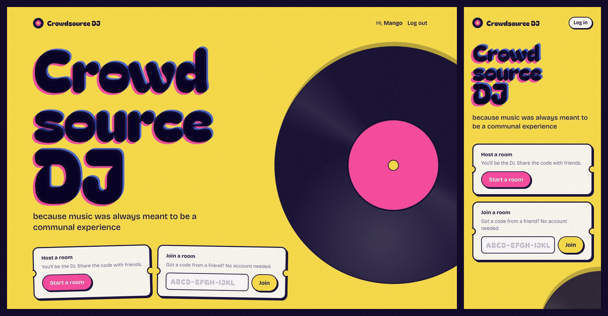

# Crowdsource DJ

**One queue. Everyone's music. The same beat, on every screen.**

Start a room, send the code to your friends, and listen together. Because music was always supposed tyo be communal.

### Start a room at [🎧 crowdsource-dj.isalive.win](https://crowdsource-dj.isalive.win/)

**Supports Playlists | Song Suggestions | Chat | Voteskip | Sync**

## How it works

1. **Start a room.** You're the DJ. You get a code like `TZSS-WNHM-VJNO`.
2. **Share the code** (or the link) with your friends.
3. **Everyone taps to listen** and starts adding songs.
4. **Party.** 🪩

## Bring your crew

Every room has a DJ, and the DJ can recruit help:

| | What they can do |
|---|---|
| 🎧 **DJ** | Everything, plus handing over the booth and closing the room |
| 🎛️ **Co-DJ** | Play, pause, skip, reorder the queue, and change room settings |
| 🛡️ **Moderator** | Remove any song, tidy up chat, and remove people who are ruining the vibe |
| 🙌 **Listener** | Listen, chat, add songs, and start a `/voteskip` |

If the DJ leaves, the booth passes to a co-DJ (or a moderator, or another listener), so the
room never goes quiet.

## Run your own

Want to host it yourself or hack on it? It's a small FastAPI + React app that runs with one
`docker compose up`. See [docs/DEVELOPMENT.md](docs/DEVELOPMENT.md) for setup, how the sync
works, tests, and configuration.
